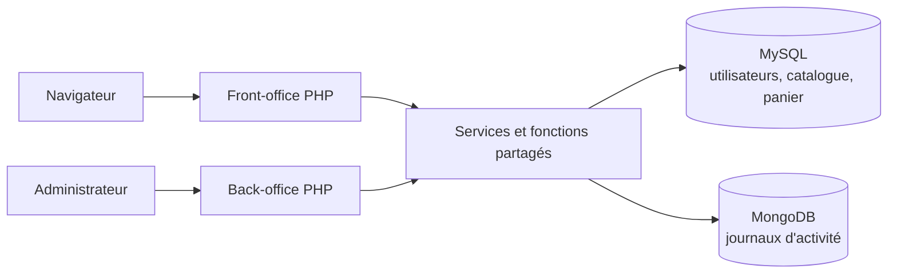
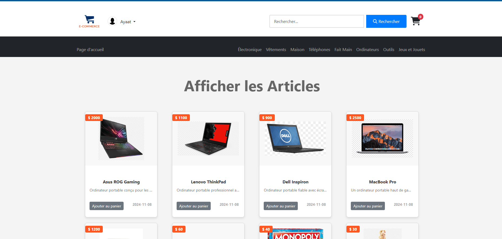
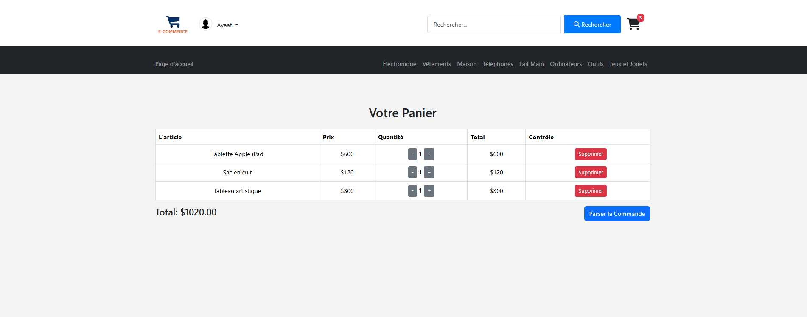
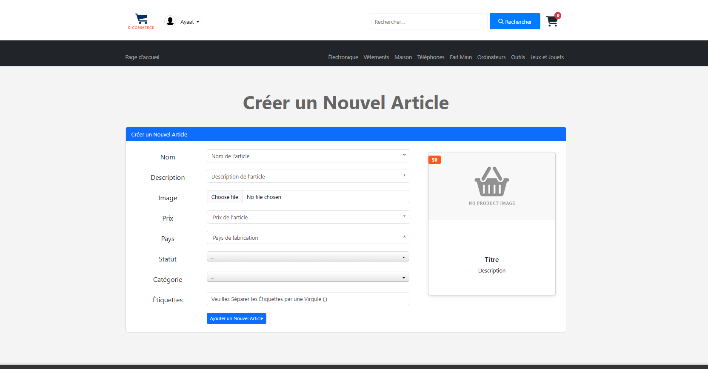
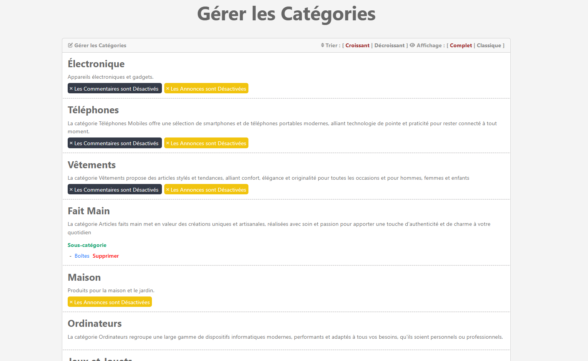

# Studi E-Commerce (E-Print) - Marketplace PHP

<p align="center">
  
</p>

<p align="center">
  Une marketplace pédagogique full-stack avec catalogue, espace membre,
  panier, modération et tableau de bord administrateur.
</p>

<p align="center">
  
  
  
  
  
</p>

> **English summary:** Studi E-Commerce is a server-rendered PHP marketplace demonstrating
> role-based journeys, product and category management, moderation, shopping-cart
> operations, relational persistence with MySQL, and activity logging with MongoDB.

## Le projet en 30 secondes

Studi E-Commerce permet à un visiteur de parcourir un catalogue, à un membre de publier et
gérer ses annonces, et à un administrateur de piloter les utilisateurs, produits,
catégories et commentaires. L'application utilise PDO pour MySQL, MongoDB pour les
journaux d'activité et Bootstrap/jQuery pour l'interface.

Ce dépôt est un **projet de formation**. Il illustre une application PHP procédurale
complète et documente explicitement les compromis techniques ainsi que les étapes
de modernisation envisagées. Le projet a été réalisé individuellement sur quatre
mois, de l'analyse des besoins au déploiement.

## Fonctionnalités par rôle

| Rôle | Capacités principales |
|---|---|
| Visiteur | Consulter les produits et catégories, rechercher par mot-clé ou tag, créer un compte |
| Membre | Se connecter, modifier son profil, publier une annonce, consulter ses annonces, commenter, gérer son panier |
| Administrateur | Consulter le tableau de bord, administrer membres/catégories/articles/commentaires, approuver les contenus, consulter les journaux d'activité |

## Architecture



L'application suit une organisation PHP procédurale avec points d'entrée par page,
gabarits partagés et fonctions d'accès aux données. Pour une lecture détaillée :

- [Architecture et flux](docs/ARCHITECTURE.md)
- [Étude de cas du projet](docs/PROJECT_CASE_STUDY.md)
- [Installation complète](docs/SETUP.md)
- [Sécurité et limites connues](docs/SECURITY.md)
- [Audit et améliorations du dépôt](docs/PROJECT_AUDIT.md)

## Stack technique

- **Back-end :** PHP 8.2, PDO, Composer
- **Données :** MariaDB/MySQL, MongoDB Atlas 6.x
- **Front-end :** HTML5, CSS3, Bootstrap 5.3, JavaScript, jQuery 3.7
- **Dépendances :** `mongodb/mongodb`, `vlucas/phpdotenv`
- **Authentification :** sessions PHP, mots de passe hachés avec `password_hash`

## Démarrage rapide

Prérequis : PHP 8.x, Composer, MySQL, MongoDB et l'extension PHP MongoDB.

```bash
git clone https://github.com/EngGhada/Studi-E-Commerce-V1.0.git
cd Studi-E-Commerce-V1.0
composer install
cp .env.example .env
```

1. Créez une base MySQL nommée `e_commerce`.
2. Importez `database/e-commercedb.sql`.
3. Adaptez `.env` à votre environnement.
4. Importez facultativement le journal de démonstration MongoDB.
5. Lancez `php -S localhost:8000`, puis ouvrez
   `http://localhost:8000`.

Les commandes détaillées et les particularités Windows figurent dans
[docs/SETUP.md](docs/SETUP.md).

## Variables d'environnement

Le fichier `.env` n'est jamais versionné. Copiez `.env.example` et remplacez
uniquement les valeurs locales :

| Variable | Usage |
|---|---|
| `DB_HOST`, `DB_PORT` | Adresse du serveur MySQL |
| `DB_DATABASE` | Nom de la base |
| `DB_USERNAME`, `DB_PASSWORD` | Identifiants MySQL |
| `MONGO_URI` | URI de connexion MongoDB |
| `MONGO_DATABASE` | Base utilisée pour les journaux |

## Base de données

Le schéma MySQL couvre cinq domaines : utilisateurs, catégories, articles,
commentaires et panier. Les clés étrangères relient les annonces à leur auteur
et leur catégorie, les commentaires à l'utilisateur et à l'article, et le panier
à l'utilisateur et au produit.

MongoDB stocke séparément les événements métier (connexion, déconnexion,
publication, modification de profil). Cette séparation illustre un usage
polyglotte des données : transactions relationnelles dans MySQL et traces
d'activité sous forme de documents.

> Les données fournies sont destinées à une démonstration locale. Aucun
> identifiant de démonstration n'est publié ici : créez un compte local, puis
> attribuez le rôle administrateur uniquement dans votre propre base si nécessaire.

## Aperçu de l'interface

<table>
  <tr>
    <td width="50%">
      
      <br><strong>Catalogue et navigation par catégorie</strong>
    </td>
    <td width="50%">
      
      <br><strong>Panier avec quantités et total dynamique</strong>
    </td>
  </tr>
  <tr>
    <td width="50%">
      
      <br><strong>Publication d'une annonce membre</strong>
    </td>
    <td width="50%">
      
      <br><strong>Gestion des catégories et permissions</strong>
    </td>
  </tr>
</table>

Ces captures authentiques proviennent de la présentation de soutenance du projet.
Elles utilisent uniquement des données de démonstration.

## Structure du dépôt

```text
.
├── admin/                  # Back-office et gestion métier
├── database/               # Schéma MySQL et exemple de journal MongoDB
├── docs/                   # Architecture, installation et sécurité
├── includes/
│   ├── cart/               # Actions AJAX du panier
│   ├── functions/          # Fonctions métier et accès aux données
│   └── templates/          # En-tête et pied de page du front-office
├── layout/                 # CSS, JavaScript, polices et images publiques
├── connect.php             # Connexions MySQL et MongoDB via .env
├── init.php                # Initialisation du front-office
└── *.php                   # Pages publiques et espace membre
```

## Sécurité

Les mots de passe sont hachés et la majorité des opérations de données utilisent
des requêtes préparées. Le dépôt ne contient pas de fichier `.env`.

Ce projet pédagogique n'est toutefois **pas prêt pour une mise en production**.
Les priorités sont l'ajout de protections CSRF, le durcissement des cookies,
la validation centralisée des fichiers téléversés, la rotation des jetons de
connexion persistante et la suppression des messages d'erreur détaillés en
production. Voir [docs/SECURITY.md](docs/SECURITY.md).

## Feuille de route

- [ ] Fournir un environnement Docker reproductible
- [ ] Ajouter des données de démonstration entièrement anonymisées
- [ ] Ajouter des tests automatisés (authentification, panier, autorisations)
- [ ] Centraliser validation, échappement et gestion des erreurs
- [ ] Ajouter des jetons CSRF et durcir les cookies de session
- [ ] Introduire une couche service/repository et un routeur
- [ ] Ajouter des captures d'écran et une courte vidéo de démonstration
- [ ] Configurer l'intégration continue (lint PHP et tests)

## Documentation

- [Installer le projet](docs/SETUP.md)
- [Lire l'étude de cas](docs/PROJECT_CASE_STUDY.md)
- [Comprendre l'architecture](docs/ARCHITECTURE.md)
- [Évaluer la sécurité](docs/SECURITY.md)
- [Consulter l'audit du dépôt](docs/PROJECT_AUDIT.md)
- Les documents sources complets contiennent des informations personnelles et
  de déploiement ; l'étude de cas en fournit une synthèse publiable.

## Auteur

Projet réalisé par [EngGhada](https://github.com/EngGhada) dans le cadre d'une
formation au développement web.
