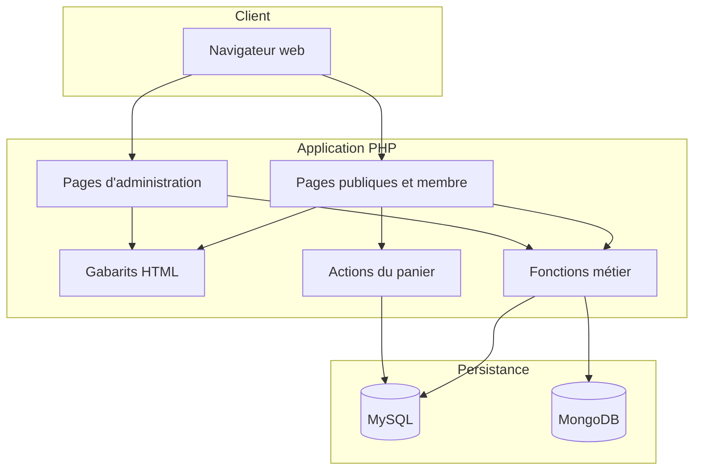

# Architecture de Studi E-Commerce

## Vue d'ensemble

Studi E-Commerce est une application PHP rendue côté serveur. Elle sépare visuellement le
front-office (`/`) du back-office (`/admin`) tout en partageant une approche
commune : initialisation, connexion aux données, fonctions métier et gabarits.

## Responsabilités des répertoires

| Zone | Responsabilité |
|---|---|
| `admin/` | Tableau de bord, gestion des membres, catégories, articles et commentaires |
| `includes/templates/` | Fragments HTML partagés du front-office |
| `includes/functions/` | Requêtes et fonctions métier communes |
| `includes/cart/` | Points d'entrée AJAX du panier |
| `layout/` | Ressources statiques du front-office |
| `database/` | Export du schéma/données MySQL et exemple de journal MongoDB |

Le back-office possède également ses propres `includes/` et `layout/`. Cette
duplication rend les deux espaces autonomes, mais constitue un futur candidat à
la mutualisation.

## Parcours principaux

### Authentification

`login.php` traite inscription et connexion. Les mots de passe sont créés avec
`password_hash` et vérifiés avec `password_verify`. Une session distingue le
membre de l'administrateur via `GroupID`.

### Publication et modération

Un membre crée une annonce depuis `newad.php`. Le champ `Approve` permet à
l'administration de valider le contenu avant sa publication générale.

### Catalogue et recherche

`index.php`, `categories.php`, `items.php`, `search.php` et `tags.php` composent
la navigation du catalogue et les vues produit.

### Panier

`cart.php` affiche le panier. Les opérations ajouter, retirer, mettre à jour et
compter sont isolées dans `includes/cart/`.

### Journalisation

Les opérations significatives sont envoyées dans la collection MongoDB
`Activities_USER_Log`. Les données commerciales restent dans MySQL.

## Modèle de données

- `users` : compte, rôle, statut et profil.
- `categories` : arborescence des catégories.
- `items` : annonces, prix, état, auteur et statut de validation.
- `comments` : avis rattachés à un membre et un article.
- `cart` : association unique entre utilisateur et article avec quantité.
- `Activities_USER_Log` (MongoDB) : événements horodatés et détails contextuels.

## Décisions et compromis

- **PHP procédural :** facile à suivre pour un projet pédagogique, mais moins
  adapté à une grande équipe qu'une architecture en couches.
- **Deux bases :** démontre MySQL et MongoDB, au prix d'une dépendance
  supplémentaire au démarrage.
- **Rendu serveur :** simple à déployer et accessible sans chaîne de build
  front-end.
- **Ressources locales :** le projet reste utilisable hors ligne après
  installation des dépendances.

## Évolution proposée

La modernisation peut être progressive sans réécriture brutale :

1. introduire une configuration centralisée et un gestionnaire d'erreurs ;
2. isoler l'accès aux données dans des repositories ;
3. déplacer la logique métier dans des services ;
4. ajouter un routeur et des contrôleurs ;
5. couvrir les parcours critiques par des tests ;
6. conteneuriser MySQL, MongoDB et PHP pour une démonstration reproductible.
